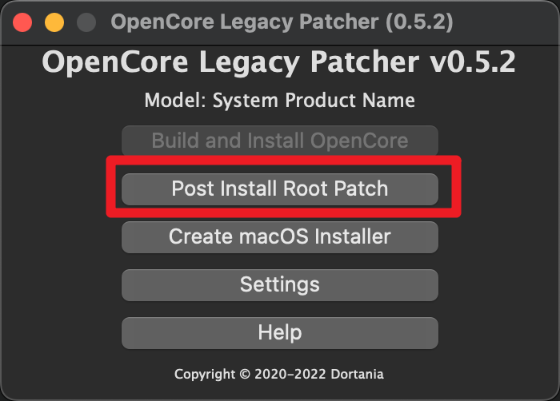

## 一、RX 460显示RX 460/560 没有功能集
> 参考：https://bbs.pcbeta.com/viewthread-1862688-1-1.html
>      https://bbs.pcbeta.com/viewthread-1847847-1-4.html
### 1、设置显卡型号
config.plist 配置
在`DeviceProperties`下添加
```xml

		<dict>
			<key>PciRoot(0x0)/Pci(0x1,0x0)/Pci(0x0,0x0)</key>
			<dict>
				<key>model</key>
				<string>Radeon RX 460</string>
			</dict>
		</dict>

```

### 2、性能增强
我没有CPU核显和有 AMD 显卡的用户：可以在 boot-args 中手动加入 cardtype=ecardonly，提升独显的工作效率。

```xml
			<key>7C436110-AB2A-4BBB-A880-FE41995C9F82</key>
			<dict>
				<key>SystemAudioVolume</key>
				<data>Rg==</data>
				<key>boot-args</key>
				<string>-v keepsyms=1 debug=0x100 agdpmod=pikera -wegnoigpu alcid=66  cardtype=ecardonly</string>
				<key>csr-active-config</key>
				<data>AAAAAA==</data>
				<key>run-efi-updater</key>
				<string>No</string>
			</dict>

```

## 二、高版本macOS兼容老旧显卡

> 环境
>
> 系统：Mac OS 13 ventura 13.0.1
>
> 显卡：Nvidia GT 710
>
> OpenCore-Legacy-Patcher 版本：0.5.2
>
> 参考：
>
> https://dortania.github.io/OpenCore-Legacy-Patcher/
>
> https://www.reddit.com/r/hackintosh/comments/y0kdho/whats_the_corresponding_data_value_to_configure/
>
> SUCCESS! I had to clear NVRAM for the new configuration to take effect then reboot again.
>
> In summary for me: NVRAM --> ADD --> boot-args STRING amfi_get_out_of_my_way=0x1 -no-compat-check
>
> csr-active-config DATA 03080000
>
> then reboot, clear NVRAM (I used CleanNVRAM.efi) which is a tool you select in the picker (before you start loading your OS). Finish booting. Then reboot.
>
> You should be able to run the patcher after.
>
> Thanks for your help!

### 1、nvram 中添加启动参数

```xml
 <key>boot-args</key>
 <string>-v keepsyms=1 debug=0x100 -wegnoigpu agdpmod=pikera alcid=66 amfi_get_out_of_my_way=0x1 -no-compat-check</string>
 <key>csr-active-config</key>
 <data>30800000</data>
```

### 2、关闭sip

从OC中进入Mac的恢复模式，然后在终端中输入`csrutil disable`来禁用SIP

```shell
csrutil status
# 禁用
csrutil disable
# 重新启用
csrutil enable
```

### 3、reset nvram

在oc引导菜单中调用reset nvram.efi 来重制

#### 4、进行修复

> 注意：如果提示SIP版本要求是0x803及其以上，那么需要修改第一步中的具体参数

